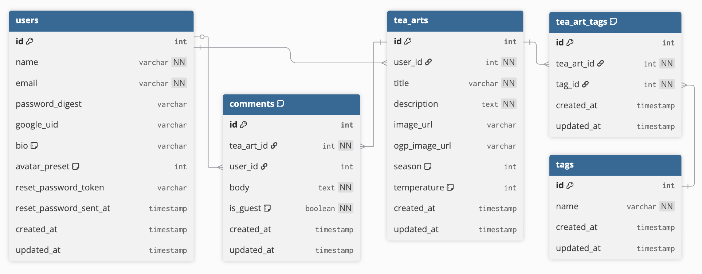

# ☕ Cafe Your Tea

### 🚪[ご来店はこちらから](https://www.cafe-your-tea.com/)

**ゲストユーザー**  
メールアドレス：cafe@example.com  
パスワード：password

## 📖 サービス概要

『Cafe Your Tea』は、ブラウザ上でオリジナルの「ティーアート」を描いて、バーチャルカフェのメニューとして投稿・共有できるお絵かきアプリです。また当カフェでは看板キャラクターのケロチャが貴方をお出迎えいたします。

**主な特徴：**

- 4 色のペンでティーの上に自由にイラスト作成
- 作品をカフェメニューとして投稿・共有
- SNS 映えする OGP 画像で拡散機能
- 非ログイン時でもメニューの閲覧やバーチャルカフェ体験が可能

## ✨ このサービスへの思い・作りたい理由

「お絵かき掲示板」というブラウザ上のペイントツールで描いた絵を投稿できる電子掲示板が、幼い頃に PC に触れて面白かった原体験として強く心に残っています。  
そこで「絵を投稿する場」でありながら、今の時代らしく SNS で共有したくなるような仕組みも追加し、さらにカフェというコンセプトを加えて独自の世界観のあるアプリを作ろうと思いました。

## 🎯 ユーザー層について

### 😆 メインターゲット：イラスト好き × SNS 発信層

**選定理由：**

- 手軽にイラストを描ける環境を求めている
- 作品を SNS で共有して反応を得たい
- 特定のテーマ（カフェメニュー）での創作に興味がある

### ☺️ サブターゲット：イラスト鑑賞好き × カフェ好き層

**選定理由：**

- 他人の作品を見ることでリラックスや刺激を得たい
- カフェ的な癒し空間を求めている
- 気軽にコメントで交流したい

## 👀 サービスの利用イメージ

### 典型的な利用フロー

1. **作成**： ティーの色を選択 → 4 色ペンでアート描画 → メニュー詳細設定
2. **投稿**： 作品をメニューとして登録 → 自動で OGP 画像生成
3. **共有**： X(Twitter)で専用 OGP 付きで投稿 → フォロワーの反応獲得
4. **交流**： 他ユーザーが「注文」→ コメント投稿 → メニュー詳細ページに反映

### 想定される使用シーン

- **通勤時間**： スマホで手軽にティーアート作成
- **リラックスタイム**： 他の人の作品を眺めながらバーチャルカフェ体験
- **SNS 投稿**： 面白い作品ができたり見つけたら X 共有

## 📢 ユーザーの獲得について

登録されたティーは「X に共有」ボタンで投稿することで、ティーやメニュー名が表示された専用 OGP 画像付きで表示されるので、アプリの趣旨がビジュアルで伝わりやすい仕組みになっています。これにより既存ユーザーが X への投稿することで、それを見て興味を持った人を更に呼び込むという形でユーザーを獲得します。

## 💖 サービスの差別化ポイント・推しポイント

### 独自の価値提案

1. **「ティーアート」という新ジャンル創造**

   - ラテアートならぬティーアート + お絵かき掲示板の融合
   - 飲み物の色も自由に変更可能な独自性

2. **SNS 拡散に最適化された設計**

   - 専用 OGP 画像の自動生成
   - 作品が一目で分かるビジュアル訴求

3. **創作初心者にも優しい環境**
   - ペンは4色限定で迷わない
   - カフェメニューというテーマで発想しやすい

### 競合との比較

| サービス | 当アプリ         | 一般的お絵かき掲示板 | ラテアートゲーム |
| -------- | ---------------- | -------------------- | ---------------- |
| テーマ性 | ○ カフェメニュー | △ 自由すぎる         | ○ ラテ限定       |
| SNS 連携 | ○ OGP 自動生成   | △ 画像のみ           | × なし           |
| 交流機能 | ○ 注文・コメント | △ 一般的             | × なし           |

## 🍵 主な機能

### TOP ページのお出迎え

<table  style="text-align: center;">
  <tr>
    <th align="center" width="50%">ケロチャとおしゃべり</th>
    <th align="center" width="50%">ピックアップティー</th>
  </tr>
  <tr>
  <!-- HTML使用時のテーブル背景色位置ズレの調整用 -->
  </tr>
  <tr>
    <td>
      
    </td>
    <td>
      
    </td>
  </tr>
  <tr>
    <td>
      ケロチャをクリックすると、おしゃべりをしてくれます。セリフは複数用意されており、時間帯（朝・昼・夕方・夜）ごとの専用セリフも楽しめます。
    </td>
    <td>
      ランダムに抽出されたティーを紹介するコーナーです。アニメーションによる演出で、見た目を楽しみながらアプリのコンセプトを直感的に理解できるようになっています。
    </td>
  </tr>
</table>

### ティーを作ったり探そう

<table  style="text-align: center;">
  <tr>
    <th align="center" width="50%">ティーアート作成</th>
    <th align="center" width="50%">メニュー</th>
  </tr>
  <tr>
  <!-- HTML使用時のテーブル背景色位置ズレの調整用 -->
  </tr>
  <tr>
    <td>
      
    </td>
    <td>
      
    </td>
  </tr>
  <tr>
    <td>
      ユーザー登録してログインすると、ティーの色を調整したり、水面にイラストを描いたりして、オリジナルのティーを作成できます。
    </td>
    <td>
      投稿されたティーが一覧で表示されます。ティーに設定された季節やタグ、ユーザー名などの条件で絞り込み検索が可能です。
    </td>
  </tr>
</table>

### ティー詳細ページで楽しもう

<table  style="text-align: center;">
  <tr>
    <th align="center" width="50%">ティーの詳細を見る</th>
    <th align="center" width="50%">ティーを注文する</th>
  </tr>
  <tr>
  <!-- HTML使用時のテーブル背景色位置ズレの調整用 -->
  </tr>
  <tr>
    <td>
      
    </td>
    <td>
      
    </td>
  </tr>
  <tr>
    <td>
      ティーの詳細ページを表示すると、より詳しい情報を確認できます。自作ティーの場合は宣伝用の「Xで共有」ボタンが表示されます。
    </td>
    <td>
      「注文する」を選ぶと、ケロチャがティーを出してくれます。ティーを飲んだ後は、「Xで共有」ボタンやコメント投稿フォームが表示されます。
    </td>
  </tr>
</table>

<table  style="text-align: center;">
  <tr>
    <th align="center" width="50%">コメント投稿（未ログイン）</th>
    <th align="center" width="50%">コメント投稿（ログイン済み）</th>
  </tr>
  <tr>
  <!-- HTML使用時のテーブル背景色位置ズレの調整用 -->
  </tr>
  <tr>
    <td>
      
    </td>
    <td>
      
    </td>
  </tr>
  <tr>
    <td>
      ログインしていない場合、コメントは定型文から選択して投稿します。投稿者名は「匿名」として表示されます。
    </td>
    <td>
      ログインしている場合、コメントは自由に入力できます。投稿者名やアバター画像は、マイページで設定した内容が反映されます。
    </td>
  </tr>
</table>

<table  style="text-align: center;">
  <tr>
    <th align="center" width="50%">コメント欄</th>
    <th align="center" width="50%">Xに投稿する</th>
  </tr>
  <tr>
  <!-- HTML使用時のテーブル背景色位置ズレの調整用 -->
  </tr>
  <tr>
    <td>
      
    </td>
    <td>
      
    </td>
  </tr>
  <tr>
    <td>
      ティーを注文したユーザーからのコメントが表示されます。コメントは無限スクロールで読み込まれます。
    </td>
    <td>
      「Xで共有」ボタンからXに投稿すると、ティーのタイトルとイラストが反映された専用のOGP画像つきで表示されます。
    </td>
  </tr>
</table>

### マイページもあるよ

<table  style="text-align: center;">
  <tr>
    <th align="center" width="50%">自分の情報を確認</th>
    <th align="center" width="50%">プロフィール情報を編集</th>
  </tr>
  <tr>
  <!-- HTML使用時のテーブル背景色位置ズレの調整用 -->
  </tr>
  <tr>
    <td>
      
    </td>
    <td>
      
    </td>
  </tr>
  <tr>
    <td>
      プロフィール情報と、自分が作成したティーの一覧が表示されます。このページは、他のユーザーからはユーザーページとして閲覧されます。
    </td>
    <td>
      お名前・アバター画像・自己紹介文は、「プロフィールを編集」ボタンから変更できます。アバター画像は、用意されている5種類の中から選択できます。
    </td>
  </tr>
</table>

## 🛠️ 使用技術

### 🎨 フロントエンド

- **React** (19.1.1)
- **Vite** (7.1.7)
- **TypeScript** (5.8.3)
- **Tailwind CSS** (4.1.13)
- **DaisyUI** (5.1.24)

#### 📦 主要ライブラリ

- **React Konva** (19.0.10) ： イラスト描画
- **React Router DOM** (7.9.3) ： ページ遷移
- **Axios** (1.12.2) - API 通信
- **@react-oauth/google** (0.12.2) ： Google 認証
- **Motion** (12.23.24) ： スムーズなアニメーション

### ⚙️ バックエンド

- **Rails** (7.1.5) ： API モード
- **Ruby** (3.2.2)

#### 💎 主要 Gem

- **JWT** + **BCrypt** ： 認証・セキュリティ
- **Googleauth** ： Google OAuth 認証
- **MiniMagick** ： 画像合成・加工
- **CarrierWave** + **Cloudinary** ： 画像アップロード・管理
- **Kaminari** ： ページネーション
- **Rack CORS** ： フロントエンドとの通信

### 🗄️ データベース

- **PostgreSQL**

### 🚀 インフラ・デプロイ

- **Docker** ： コンテナ環境
- **Vercel** ： フロントエンドホスティング
- **Render** ： バックエンドホスティング
- **Neon** ： PostgreSQL ホスティング

### 🔗 外部サービス

- **Cloudinary** ： 画像ストレージ
- **Resend** ： メール配信

## 🗺️ 画面遷移図

[→Figma で画面遷移図を表示](https://www.figma.com/design/V7rBgr4WfG9d6M01zOaWk0/%E7%94%BB%E9%9D%A2%E9%81%B7%E7%A7%BB%E5%9B%B3?node-id=0-1&t=md05UsXyjIjx4hgN-1)

## 🗃️ ER 図

